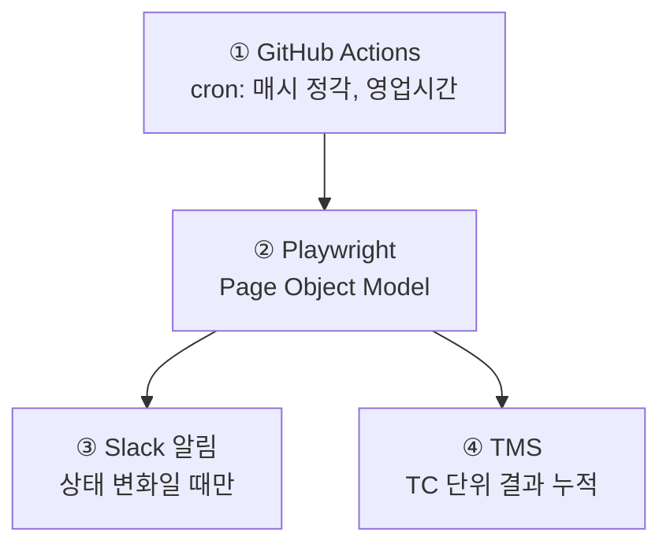
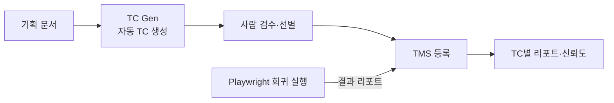

웹 서비스 개발팀에서 가장 자주 나오는 질문 중 하나가 "이거 배포하면 기존 기능 안 깨질까?" 입니다. 특히 소프트웨어는 소프트하기 때문에 A 기능을 고치면 B나 C 기능이 깨지는 경우가 많습니다. 문제는 B나 C 기능에 QA 리소스를 투입하지 못하고 운영 환경에서 고객이 먼저 발견하는 경우가 많다는 것입니다. 기존 기능이 다 잘 돌아가는지 점검하려면, 팀 규모가 일정한데 새로운 기능이 계속 추가되는 상황에서는 QA 리소스가 기능 수에 비례해 선형적으로 증가해야 하는 상황인 거죠.

이 글은 QA 리소스가 기능 추가 속도에 끌려가지 않도록, 이미 개발된 기능은 자동으로 테스트하는 파이프라인을 설계한 기록입니다. 툴 선택보다는 **전체 흐름의 설계 의도** — 언제 돌릴지, 실패를 어떻게 알릴지, 결과를 어디에 쌓을지 — 를 중심으로 풀어보려 합니다.

## 설계 한눈에



네 블록 각각이 왜 그 모양이어야 했는지를 순서대로 적어봅니다.

## 스케줄 설계

저희는 새벽에 데이터 수집·전처리가 돌아가는 시간이라, 테스트는 영업시간에만 진행하도록 스케줄을 설정했습니다. 에러가 발생했을 때 바로 대응할 수 있다는 점도 이 선택의 이유입니다.

```yaml
on:
  schedule:
    - cron: '0 0-14 * * *'  # KST 09:00 ~ 23:00
```

## Playwright + POM

테스트 러너는 Playwright, 구성은 Page Object Model 로 잡았습니다. 여기선 설계상 중요한 포인트만 짚습니다.

- **POM 으로 스펙을 얇게** — `tests/*.spec.ts` 는 시나리오만, 클릭/입력 세부는 `src/pages/*Page.ts` 로. 회귀 테스트는 UI가 바뀌어도 테스트 시나리오가 바뀌지 않는다면 유지보수 비용이 적게 듭니다.
- **멀티 계정 병렬** — 언어별·권한별로 독립된 계정이 필요하면 Playwright `projects` 별로 `storageState` 를 분리해 병렬 실행합니다.

**셀렉터는 `data-testid` 로 통일.** CSS 클래스나 텍스트는 디자인·카피 변경에 쉽게 흔들립니다. 테스트가 참조하는 요소는 `data-testid` 로 식별하고, POM 내부에서는 `page.getByTestId(...)` 만 사용합니다. 프론트 리팩토링과 테스트 코드가 디커플링되어, 스타일 작업이 회귀를 깨뜨리지 않습니다.

```tsx
// 프론트엔드 컴포넌트
<button data-testid="audience-create">생성</button>

// 테스트 (POM 내부)
this.page.getByTestId('audience-create').click();
```

## "상태 변화" 기반 Slack 알림

매시간 성공이나 실패 알림이 일정하게 오면 사람들은 곧 무시합니다(alert fatigue). 그래서 원칙을 하나 세웠습니다.

> **"이전 실행과 결과가 달라졌을 때만 알림"**

즉, `pass → fail` 전환과 `fail → pass` 복구 순간에만 Slack 을 호출합니다. 연속 실패 중이면 조용합니다.

구현은 GitHub Actions 스텝 안에서 직전 run의 conclusion을 GitHub API로 조회한 뒤 분기하는 방식입니다.

```yaml
- name: Get previous run status
  id: prev
  run: |
    PREV=$(curl -s -H "Authorization: Bearer ${{ github.token }}" \
      "https://api.github.com/repos/${{ github.repository }}/actions/workflows/regression-test.yml/runs?status=completed&per_page=1" \
      | python3 -c "import sys,json; runs=json.load(sys.stdin).get('workflow_runs',[]); print(runs[0]['conclusion'] if runs else 'none')")
    echo "conclusion=$PREV" >> "$GITHUB_OUTPUT"

- name: Notify Slack on status change to failure
  if: steps.test.outcome == 'failure' && steps.prev.outputs.conclusion != 'failure'
  uses: slackapi/slack-github-action@v2.1.0
  ...
```

알림 페이로드 자체도 얕게 넘기면 결국 링크만 클릭하게 됩니다. Playwright 의 `results.json` 을 `jq` 로 파싱해서 **파일명 · 테스트 타이틀 · 실패한 스텝 · 에러 메시지 첫 줄**까지 Slack 본문에 포함시키고, 실패 스크린샷은 `files.uploadV2` 로 첨부합니다. Slack 에서 스크린샷을 바로 보고 원인을 추정할 수 있게 만드는 게 목표였습니다.

## TC Gen → TMS

회귀 테스트 파이프라인의 궁극적 목적은 **"어떤 기능이 얼마나 안정적인가"** 를 TC 단위로 추적하는 것인데, 이건 TC 자체의 라이프사이클이 자동화되어 있어야 가능합니다. 저희는 **TC Gen** 과 **TMS** 두 도구를 묶어 다음 흐름으로 통합했습니다.



- **TC Gen** — 기획 문서를 입력으로 받아 후보 TC들을 자동 생성합니다. 새 기능이 들어올 때 "이건 테스트해야 한다"는 판단이 별도 공수 없이 기획 단계 출력물로 나옵니다.
- **검수 게이트** — 자동 생성된 TC 전부가 회귀에 들어가면 금방 노이즈가 됩니다. 사람이 한 번 골라낸, **실제로 회귀 보장할 가치가 있는** TC만 TMS 에 등록합니다.
- **TMS** — 등록된 TC는 Playwright 회귀 실행 결과와 연결되어, TC별 최근 실패 히스토리·flaky rate·평균 실행 시간을 한 화면에서 볼 수 있습니다. 즉 TMS 는 **TC 카탈로그 + 회귀 결과 리포지토리**를 겸하는 통합 시스템입니다.

Slack 이 "지금 무슨 일이 벌어졌는가" 에 강하다면, TMS 는 "지난 한 달간 얼마나 안정적이었는가" 에 강한 도구입니다. 두 축을 분리해 두니 알림과 장기 신뢰도를 각자 최적화할 수 있었습니다.

## 정리

| 설계 결정                     | 이유                                                  |
| ----------------------------- | ----------------------------------------------------- |
| 매시간 × 영업시간 cron        | 재현성 좋은 시간대에만 돌려 커버리지·노이즈 균형      |
| POM + 멀티 계정 병렬          | UI 변경 대응 비용 최소화, 권한/언어별 플로우 커버     |
| 상태 변화 기반 Slack 알림     | alert fatigue 방지 — "조용한 CI" 가 결국 더 잘 보인다 |
| 실패 페이로드 풍부화          | Slack 에서 클릭 한 번으로 원인 추정                   |
| TC Gen → TMS 통합             | 기획 → TC 생성 → 검수 → 회귀 결과까지 한 흐름에서 추적 |

리그레션 테스트는 "돌아가느냐" 보다 "**돌아간 뒤에 무엇이 남느냐**" 가 훨씬 중요합니다. 즉각적인 알림은 Slack 으로, 장기 신뢰도는 TMS 로 — 이 둘을 분리하고 나니 테스트 파이프라인이 비로소 의사결정에 쓸 수 있는 데이터가 되었습니다.
